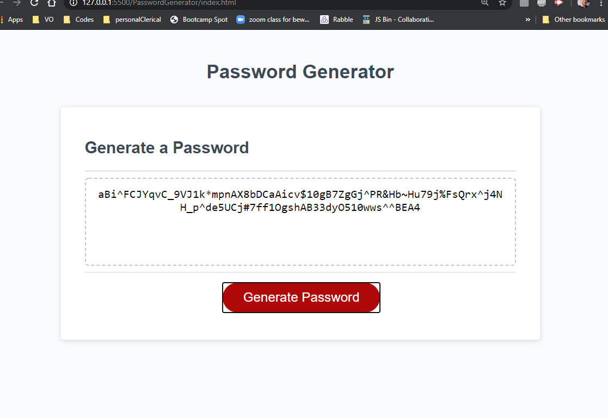

# PasswordGenerator

# This project includes a static site html with Javascript randomized password generator with selector prompts.

When the user:

- Clicks the generate password Button:

Then:

- The user will be asked for a desired password length until a correct value has been entered.
- Confirmation requests will be made as to the inclusion or exclusion of possible character sets.
- Once all questions have been answered, a randomized password of specified length will be generated for the user in the text box above the button in the GUI of the index.html site.

# deployed site url:

# Preview Photo:

